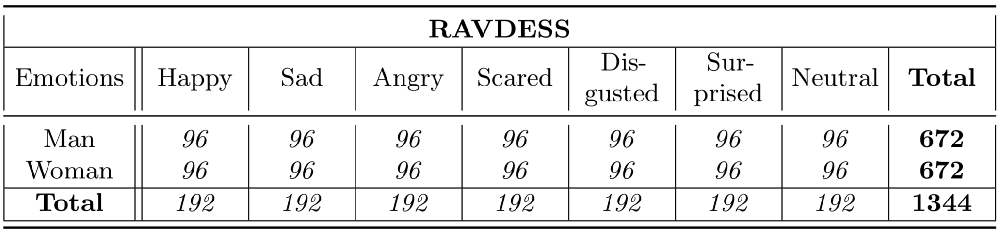
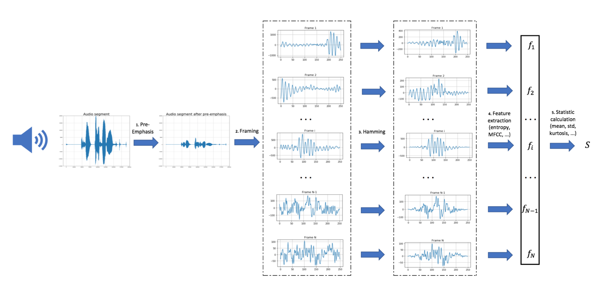
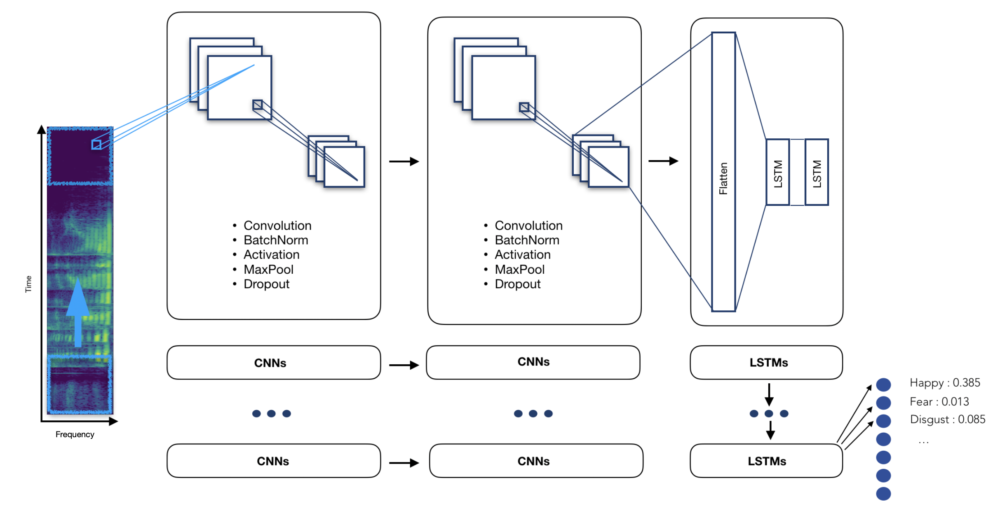
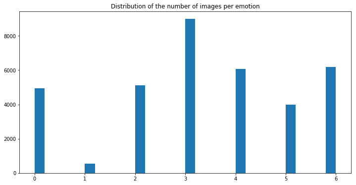
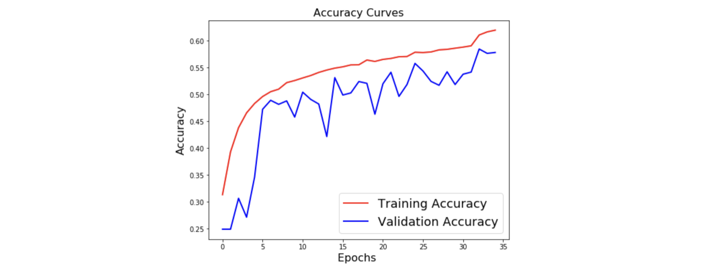
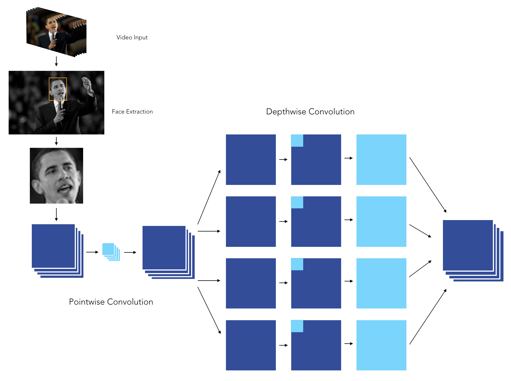
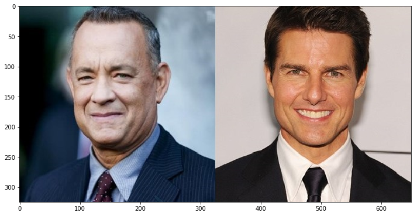
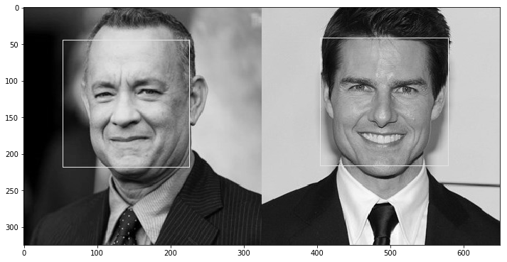
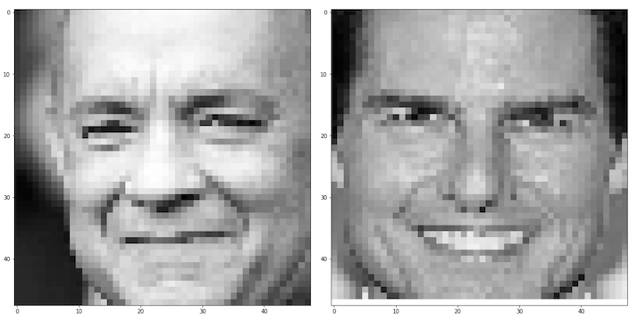

  

<h1 align="center">AI Interview ML</h1>

  
  
  
  
  

  
  
  
  
  
  

# About

Selection in big companies requires an aspirant to be proficient in coding as well as fluent in his words. The latter sometimes becomes a major anchor for various students with the ability to achieve high otherwise. This is a problem that our current interface looks at resolving. We are building an interface that helps users with a situation by the use of an AI that asks questions on the basis of a code which the aspirant has written, asked from a diverse pack of frequently asked coding questions. Then the AI asks the aspirant questions related to his code and some staple questions. At the end of this experience, the user receives his interview profile showing him his flaws in answering questions, his fluency, and his ability to handle the situation verbally. This can be done on various levels and be stored for future scrutiny by the user. We can also provide a growth curve that helps the aspirant to judge his progress.

---

# Speech Emotion Recognition [Audio]

The aim of this section is to explore speech emotion recognition techniques from an audio recording.

## Data

**RAVDESS** contains 24 professional actors (12 female, 12 male), vocalizing two lexically-matched statements in a neutral North American accent. Speech includes calm, happy, sad, angry, fearful, surprise, and disgust expressions, and song contains calm, happy, sad, angry, and fearful emotions. Each expression is produced at two levels of emotional intensity (normal, strong), with an additional neutral expression. [Dataset](https://www.kaggle.com/uwrfkaggler/ravdess-emotional-speech-audio/download)

## Files

The different files that can be found in this repo :
- `Model` : Saved models (SVM and TimeDistributed CNNs)
- `Notebook` : All notebooks (preprocessing and model training)
- `Python` : Personal audio library
- `Images`: Set of pictures saved from the notebooks and final report
- `Resources` : Some resources on Speech Emotion Recognition

Notebooks provided on this repo:
- `01 - Preprocessing[SVM].ipynb` : Signal preprocessing and feature extraction from time and frequency domain (global statistics) to train SVM classifier.
- `02 - Train [SVM].ipynb` : Implementation and training of SVM classifier for Speech Emotion Recognition
- `01 - Preprocessing[CNN-LSTM].ipynb` :  Signal preprocessing and log-mel-spectrogram extraction to train TimeDistributed CNNs
- `02 - Train [CNN-LSTM].ipynb` : Implementation and training of TimeDistributed CNNs classifier for Speech Emotion Recognition

# Models

## SVM

Classical approach for Speech Emotion Recognition consists in applying a series of filters on the audio signal and partitioning it into several windows (fixed size and time-step). Then, features from time domain (**Zero Crossing Rate, Energy** and **Entropy of Energy**) and frequency domain (**Spectral entropy, centroid, spread, flux, rolloff** and **MFCCs**) are extracted for each frame. We compute then the first derivatives of each of those features to capture frame to frame changes in the signal. Finally, we calculate the following global statistics on these features: *mean, median, standard deviation, kurtosis, skewness, 1% percentile, 99% percentile, min, max* and *range* and train a simple SVM classifier with rbf kernel to predict the emotion detected in the voice.

 

SVM classification pipeline:
- Voice recording
- Audio signal discretization
- Apply pre-emphasis filter
- Framing using a rolling window
- Apply Hamming filter
- Feature extraction
- Compute global statistics
- Make a prediction using our pre-trained model

## TimeDistributed CNNs

The main idea of a **Time Distributed Convolutional Neural Network** is to apply a rolling window (fixed size and time-step) all along the log-mel-spectrogram. Each of these windows will be the entry of a convolutional neural network, composed by four Local Feature Learning Blocks (LFLBs) and the output of each of these convolutional networks will be fed into a recurrent neural network composed by 2 cells LSTM (Long Short Term Memory) to learn the long-term contextual dependencies. Finally, a fully connected layer with *softmax* activation is used to predict the emotion detected in the voice.

TimeDistributed CNNs pipeline:
- Voice recording
- Audio signal discretization
- Log-mel-spectrogram extraction
- Split spectrogram with a rolling window
- Make a prediction using our pre-trained model

## Performance

To limit overfitting during training phase, we split our data set into train (80%) and test set (20%). Following show results obtained on test set:

|       Model                             |   Accuracy    |
|-----------------------------------------|---------------|
| SVM on global statistic features        |     68,3%     |
| Time distributed CNNs                   |     76,6%     |

---

# Facial Emotion Recognition [Video]

The aim of this section is to explore facial emotion recognition techniques from a live webcam video stream.

## Data

The data set used for training is the **Kaggle FER2013** emotion recognition data set : https://www.kaggle.com/c/challenges-in-representation-learning-facial-expression-recognition-challenge/data

The data consists of 48x48 pixel grayscale images of faces. The faces have been automatically registered so that the face is more or less centered and occupies about the same amount of space in each image. The task is to categorize each face based on the emotion shown in the facial expression in to one of seven categories (0=Angry, 1=Disgust, 2=Fear, 3=Happy, 4=Sad, 5=Surprise, 6=Neutral).

## Files

The different files that can be found in this repo :
- `Images` : All pictures used in the ReadMe, in the notebooks or save from the models
- `Resources` : Some resources that have been used to build the notebooks
- `Notebooks` : Notebooks that have been used to obtain the final model
- `Model`: Contains the pre-trained models for emotion recognition, face detection and facial landmarks
- `Python` : The code to launch the live facial emotion recognition

Among the notebooks, the role of each notebook is the following :
- `01-Pre-Processing.ipynb` : Transform the initial CSV file into train and test data sets
- `02-HOG_Features.ipynb` : A manual extraction of features (Histograms of Oriented Gradients, Landmarks) and SVM
- `03-Pre-Processing-EmotionalDAN.ipynb` : An implementation of Deep Alignment Networks to extract features
- `04-LGBM.ipynb` : Use of classical Boosting techniques on top on flatenned image or auto-encoded image
- `05-Simple_Arch.ipynb` : A simple Deep Learning Architecture
- `06-Inception.ipynb` : An implementation of the Inception Architecture
- `07-Xception.ipynb` : An implementation of the Xception Architecture
- `08-DeXpression.ipynb` : An implementation of the DeXpression Architecture
- `09-Prediction.ipynb` : Live Webcam prediction of the model
- `10-Hybrid.ipynb` : A hybrid deep learning model taking both the HOG/Landmarks model and the image

## Video Processing

#### Pipeline

The video processing pipeline was built the following way :
- Launch the webcam
- Identify the face by Histogram of Oriented Gradients
- Zoom on the face
- Dimension the face to 48 * 48 pixels
- Make a prediction on the face using our pre-trained model
- Also identify the number of blinks on the facial landmarks on each picture

#### Model

The model we have chosen is an **XCeption** model, since it outperformed the other approaches we developed so far. We tuned the model with :
- Data augmentation
- Early stopping
- Decreasing learning rate on plateau
- L2-Regularization
- Class weight balancing
- And kept the best model

The XCeption architecture is based on DepthWise Separable convolutions that allow to train much fewer parameters, and therefore reduce training time on Colab's GPUs to less than 90 minutes.

When it comes to applying CNNs in real life application, being able to explain the results is a great challenge. We can indeed  plot class activation maps, which display the pixels that have been activated by the last convolution layer. We notice how the pixels are being activated differently depending on the emotion being labeled. The happiness seems to depend on the pixels linked to the eyes and mouth, whereas the sadness or the anger seem for example to be more related to the eyebrows.

## Performance

The set of emotions we are trying to predict are the following :
- Happiness
- Sadness
- Fear
- Disgust
- Surprise
- Neutral
- Anger

The models have been trained on Google Colab using free GPUs.

|       Features                          |   Accuracy    |
|-----------------------------------------|---------------|
| LGBM on flat image                      |     --.-%     |
| LGBM on auto-encoded image              |     --.-%     |
| SVM on HOG Features                     |     32.8%     |
| SVM on Facial Landmarks features        |     46.4%     |
| SVM on Facial Landmarks and HOG features|     47.5%     |
| SVM on Sliding window Landmarks & HOG   |     24.6%     |
| Simple Deep Learning Architecture       |     62.7%     |
| Inception Architecture                  |     59.5%     |
| Xception Architecture                   |     64.5%     |
| DeXpression Architecture                |     --.-%     |
| Hybrid (HOG, Landmarks, Image)          |     45.8%     |

# Live prediction

Since the input data is centered around the face, making a live prediction requires :
- identifying the faces
- then, for each face :
  - zoom on it
  - apply grayscale
  - reduce dimension to match input data

The treatment of the image is done through OpenCV

*1. Read the initial image*

*2. Apply gray filter and find faces*

*3. Zoom and rescale each image*

---

## How to Contribute to AI Interview ML?

- Take a look at the Existing [Issues](https://github.com/aryasoni98/AI-Interview/issues) or create your own Issues!
- Wait for the Issue to be assigned to you.
- Fork the repository
- Have a look at [Contibuting Guidelines](https://github.com/aryasoni98/AI-Interview/blob/master/CONTRIBUTING.md)

---

<table>
 	<tr>
 		<td align="center">
 			
 				 
			 <a href="https://github.com/aryasoni98/AI-Interview/discussions">
 		   		Github Discussions
 	    	</a>
 		</td>
		<td align="center">
 			
 				 
			<a href="https://discord.gg/c9M6MZg6yJ">
 		   		Join Discord
 	    	</a>
 		</td>
 	</tr>
 </table>

---

### Project Member ❤️

<table>
 	<tr>
 		<td align="center">
 			<a href="https://github.com/aryasoni98">
 				
 				  <b>Arya Soni</b>
 			</a>
 				  <a href="https://github.com/aryasoni98">
 		   			Admin
 	   		 </a>
 		</td>
		<td align="center">
 			<a href="https://github.com/shubhigupta991">
 				
 				  <b>Shubhangi Gupta</b>
 			</a>
				 <a href="https://github.com/shubhigupta991">
					Member
 	    	</a>
 		</td>
 	</tr>
</table>

---

### Contributors 🌟

#### Thanks goes to these wonderful people ✨✨:

<table>
	<tr>
		<td>
			
		</td>
	</tr>
</table>

---

<table>
 	<tr>
 		<td align="center">
			
 		</td>
		 <td align="center">
 			
 		</td>
 	</tr>
</table>
